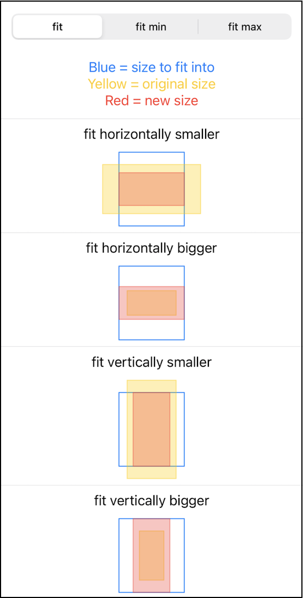
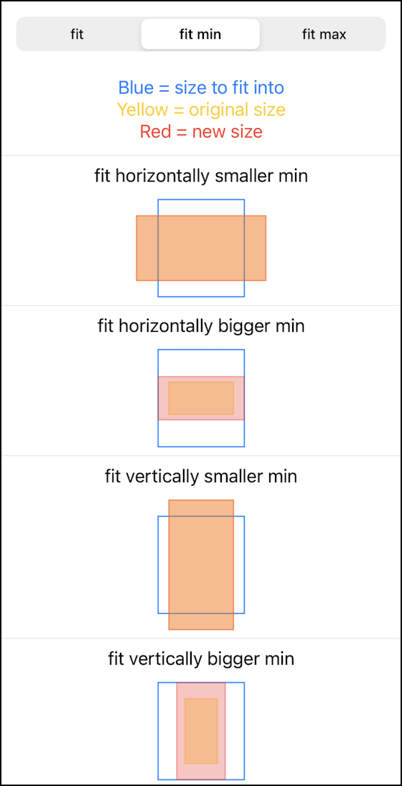
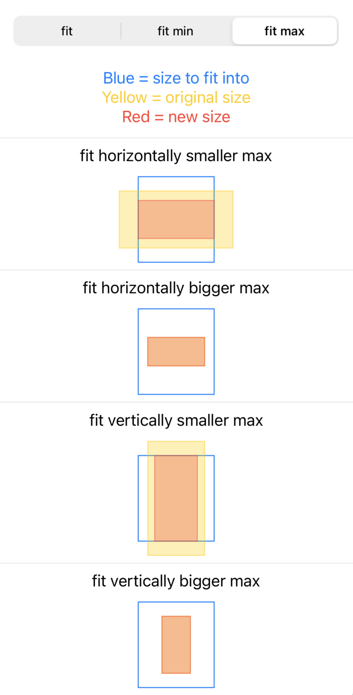

<p>
    
    <a href="https://swift.org/package-manager">
        
    </a>
    
</p>

# ScaledToFit

ScaledToFit is a small library that provides funtions to scale up or down a rectangle size so that it fits into another rectangle size.
The scaling is done so that the aspect ratio is preserved.

The spm package contains an example SwiftUI project which also contains visual tests to see how the scaling works and can be used to verify that it is correct.

The following screenshots are showing the scaling in action:

<span>



</span>

## Usage

The scale logic itself is available in the generic `Size` type, which works with (width, height) tuples of any FloatingPoint type.
So this can be used by any code, no matter the actual type of the size or rectangle:

`let scaledSize = Size.scaledToFit(orinigalSize: (10, 15), size: (20, 30))`

There is also a convenience extension for the CGSize type, which is available for all of Apple's platform SDKs:

```
let originalSize = CGSize(width: 10, height: 15)
let containerSize = CGSize(width: 20, height: 30)
let scaledSize = originalSize.scaledToFit(size: containerSize)
```

If you want to only scale down, use `scaledDownToFit`:

`let scaledSize = originalSize.scaledDownToFit(maxSize: containerSize)`

The new size will be a smaller version of the original size.
If the original size completely fits into the provided container size, the function will return `nil`, indicating that no scaling is necessary.
You can fall back to the original size in that case:

`let scaledSize = originalSize.scaledDownToFit(maxSize: containerSize) ?? originalSize`

Similarly, if you want to only scale up, use `scaledUpToFit`.
The new size will be a larger version of the original size, or `nil` if no scaling is needed.

## Installation with Swift Package Manager

Use this URL as a dependency:
`https://github.com/WilhelmOks/ScaledToFit.git`
