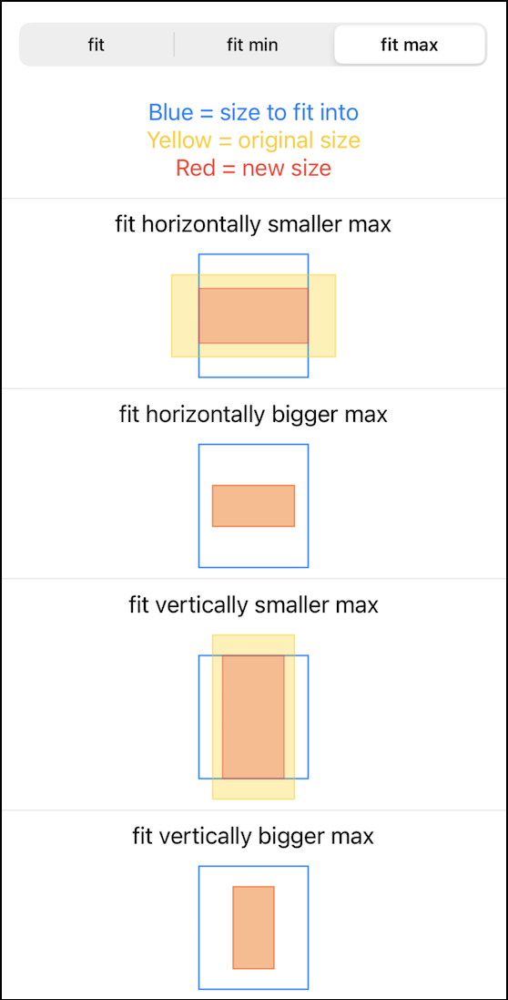

    
    
    

# ScaledToFit

ScaledToFit is a small library that provides funtions to scale up or down a rectangle size so that it fits into another rectangle size.
The scaling is done so that the aspect ratio is preserved.

The spm package contains an example SwiftUI project which also contains visual tests to see how the scaling works and can be used to verify that it is correct.

The following screenshots are showing the scaling in action:

## Usage

TODO

## Installation with Swift Package Manager

Use this URL as a dependency:
`https://github.com/WilhelmOks/ScaledToFit.git`
